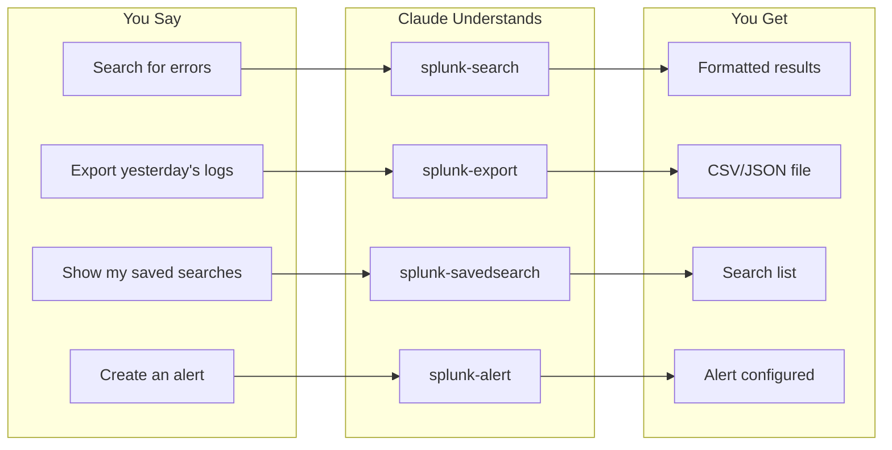
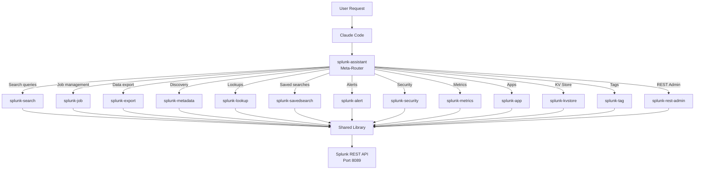

<p align="center">
  
</p>

<h1 align="center">Splunk Assistant Skills</h1>

<table align="center">
<tr>
<td align="center">
<h2>80%</h2>
<sub>Faster than manual<br>SPL workflows</sub>
</td>
<td align="center">
<h2>14</h2>
<sub>Specialized skills<br>one conversation</sub>
</td>
<td align="center">
<h2>62</h2>
<sub>Production-ready<br>Python scripts</sub>
</td>
<td align="center">
<h2>0</h2>
<sub>SPL syntax<br>to memorize</sub>
</td>
</tr>
</table>

<p align="center">
  
  
  
  
  
</p>

<p align="center">
  <strong>Talk to Splunk like a colleague, not a query language.</strong><br>
  <sub>Natural language search, job management, and administration for Splunk via Claude Code.</sub>
</p>

<div align="center">

```
> "Show me error patterns in the main index from the last hour"

Claude: Running SPL query...
  index=main error earliest=-1h | stats count by host, sourcetype | sort -count

Found 847 errors across 12 hosts. Top sources:
  web-prod-01  nginx:error     423
  api-srv-03   application     298
  db-master    postgresql      126
```

</div>

<p align="center">
  <a href="#quick-start"><strong>Get Started</strong></a> &bull;
  <a href="#skills-overview">Skills</a> &bull;
  <a href="#who-is-this-for">Use Cases</a> &bull;
  <a href="#architecture">Architecture</a>
</p>

---

## The Difference

<table>
<tr>
<td width="50%">

### The SPL Way
```spl
index=main sourcetype=access_combined
| eval response_time=response_time/1000
| where response_time > 2
| stats avg(response_time) as avg_rt,
        max(response_time) as max_rt,
        count by host
| sort -count
| head 10
```
*Hope you remembered the syntax...*

</td>
<td width="50%">

### The Natural Way
```
"Show me slow API responses over 2 seconds,
 grouped by host, top 10"
```
*Just ask.*

</td>
</tr>
</table>

### Time Saved

| Task | Traditional Splunk | Splunk Assistant | Saved |
|------|------------------|----------------|-------|
| Write complex SPL query | 5-15 min | 30 sec | 90% |
| Check job status & results | 2-3 min | 10 sec | 95% |
| Export large dataset | 5-10 min | 1 min | 85% |
| Create saved search | 3-5 min | 30 sec | 90% |
| Debug search errors | 5-20 min | 1 min | 80% |

**Typical user:** Save 3-5 hours per week.

---

## Quick Start

### Option A: Install as Claude Code Plugin (Recommended)

```bash
# Add the marketplace
/plugin marketplace add grandcamel/Splunk-Assistant-Skills

# Install all skills
/plugin install splunk-assistant@splunk-assistant-skills
```

### Option B: Manual Installation

#### 1. Install Dependencies

```bash
pip install -r .claude/skills/shared/scripts/lib/requirements.txt
```

#### 2. Get API Token

1. Log into Splunk Web
2. Go to **Settings > Tokens**
3. Click **New Token**, select your user
4. Copy the generated token

#### 3. Configure

```bash
# Set environment variables
export SPLUNK_TOKEN="your-jwt-token"
export SPLUNK_SITE_URL="https://splunk.example.com"

# Or create .claude/settings.local.json for profiles
```

#### 4. Start Using

```bash
# Direct script execution
python .claude/skills/splunk-search/scripts/search_oneshot.py \
  "index=main | stats count by sourcetype" --earliest -1h

# Or with Claude Code
> "Search for errors in the main index from the last hour"
```

**That's it.** Claude now has full Splunk access.

<p align="center">
  <a href="CLAUDE.md"><strong>Full Setup Guide</strong></a>
</p>

---

## What You Can Do



<details>
<summary><strong>Example: Security Analyst's Morning</strong></summary>

**Before Splunk Assistant (45 minutes)**
1. Open Splunk Web, navigate to search
2. Write SPL for failed logins: `index=security action=failure | stats count by user, src_ip | sort -count`
3. Copy results, open spreadsheet
4. Write another query for privilege escalation
5. Cross-reference with yesterday's baseline
6. Document findings in ticket

**After Splunk Assistant (5 minutes)**
> Analyst: "Show me failed logins in the last 24 hours, group by user and source IP, compare to yesterday's baseline, and flag any anomalies"

Claude provides a formatted summary with highlighted anomalies.

**Time saved:** 40 minutes every morning

</details>

---

## Skills Overview

| Skill | Purpose | Example Command |
|-------|---------|-----------------|
| `splunk-assistant` | Hub router with progressive disclosure | "Help me search Splunk" |
| `splunk-search` | SPL query execution (oneshot/normal/blocking) | "Search for 404 errors in nginx logs" |
| `splunk-job` | Search job lifecycle management | "Check status of job abc123" |
| `splunk-export` | High-volume streaming extraction | "Export last week's firewall logs to CSV" |
| `splunk-metadata` | Index, source, sourcetype discovery | "List all available indexes" |
| `splunk-lookup` | CSV and lookup file management | "Upload users.csv as a lookup" |
| `splunk-tag` | Knowledge object tagging | "Tag host web-01 as production" |
| `splunk-savedsearch` | Reports and scheduled searches | "Show my saved searches" |
| `splunk-alert` | Alert triggering and monitoring | "Create alert for high error rate" |
| `splunk-rest-admin` | REST API configuration access | "Get server info" |
| `splunk-security` | Token management and RBAC | "List authentication tokens" |
| `splunk-metrics` | Real-time metrics (mstats, mcatalog) | "Show CPU metrics by host" |
| `splunk-app` | Application management | "List installed apps" |
| `splunk-kvstore` | App Key Value Store operations | "Query the threat intel collection" |

<p align="center">
  <a href="CLAUDE.md"><strong>Full Scripts Reference</strong></a>
</p>

---

## Who Is This For?

<details>
<summary><strong>Developers</strong> — Never leave your terminal</summary>

**Stop context-switching to Splunk Web.**

You're debugging in your IDE. You need to check logs. Stay in your terminal.

```bash
claude "Show me errors from my-app in the last hour"
# Done in 3 seconds, never left your terminal
```

### Developer Cheat Sheet

| Task | Command |
|------|---------|
| Search logs | "Search for errors in app-name last hour" |
| Check deployments | "Find deployment events today" |
| Debug issues | "Show stack traces from main index" |
| Export for analysis | "Export last 1000 errors to JSON" |

**Time saved:** ~45 min/week

</details>

<details>
<summary><strong>Security Analysts</strong> — Investigate faster</summary>

**Accelerate threat hunting and incident response.**

### Quick Investigations
```
"Find all failed SSH attempts in the last 24 hours"
"Show authentication events for user john.doe"
"Search for privilege escalation patterns"
```

### Common Operations

| Task | Command |
|------|---------|
| Failed logins | "Show failed logins by user and IP" |
| Suspicious activity | "Find unusual outbound connections" |
| Threat hunting | "Search for indicators: 192.168.1.100, malware.exe" |
| Incident timeline | "Build timeline for host web-01 last 4 hours" |

**Time saved:** Minutes per investigation

</details>

<details>
<summary><strong>IT Operations</strong> — Monitor and respond</summary>

**Real-time visibility without the query complexity.**

### Quick Actions
```
"Show critical alerts from last 24 hours"
"Check system health across all hosts"
"Find hosts with high CPU usage"
```

### Common Operations

| Task | Command |
|------|---------|
| Alert review | "Show triggered alerts today" |
| Performance | "CPU and memory stats by host" |
| Capacity | "Disk usage trends this week" |
| Incidents | "Errors across production hosts" |

**Time saved:** Hours per week on routine checks

</details>

<details>
<summary><strong>Data Engineers</strong> — ETL without the complexity</summary>

**Extract data at scale with simple commands.**

### Data Extraction
```
"Export last week's firewall logs to CSV"
"Stream authentication events to JSON file"
"Download metrics data for analysis"
```

### Common Operations

| Task | Command |
|------|---------|
| Bulk export | "Export index=main last 7 days to CSV" |
| Filtered extract | "Export errors from web tier to JSON" |
| Metrics dump | "Download CPU metrics for all hosts" |
| Schema discovery | "Show all fields in sourcetype=nginx" |

**Time saved:** Hours per data pipeline

</details>

---

## Architecture



### Technical Highlights

- **Dual Authentication**: JWT Bearer tokens (preferred) and Basic Auth support
- **Multi-Profile**: Configure dev/staging/production environments
- **Search Modes**: Oneshot (ad-hoc), Normal (async), Blocking (sync), Export (streaming)
- **Progressive Disclosure**: 3-level optimization guidance
- **Robust Error Handling**: Custom exception hierarchy with retry logic
- **Type-Safe**: Full type annotations and input validation

---

## Quality & Security

### Test Coverage

| Category | Tests | Description |
|----------|------:|-------------|
| Unit Tests | 73 | Core library validation |
| Integration Tests | 175 | Live Splunk API verification |
| **Total** | **248** | Comprehensive coverage |

> Tests run against live Splunk instances to ensure real-world reliability.

### Security

- **No credentials in code** — Environment variables or `.local.json` files (gitignored)
- **Token-based auth** — JWT Bearer tokens preferred over Basic Auth
- **Input validation** — All user input sanitized before API calls
- **No destructive defaults** — Explicit confirmation required for dangerous operations

---

## Try It

[](https://codespaces.new/grandcamel/Splunk-Assistant-Skills)

One-click cloud environment with all dependencies pre-installed.

---

## Documentation

| Resource | Description |
|----------|-------------|
| [CLAUDE.md](CLAUDE.md) | Comprehensive project documentation |
| [CHANGELOG.md](CHANGELOG.md) | Version history and release notes |
| Skill SKILL.md files | Per-skill detailed documentation |

### Need Help?

- [GitHub Discussions](https://github.com/grandcamel/Splunk-Assistant-Skills/discussions)
- [Report Issues](https://github.com/grandcamel/Splunk-Assistant-Skills/issues)

---

## Contributing

Contributions are welcome! See our contributing guidelines.

```bash
# Clone the repository
git clone https://github.com/grandcamel/Splunk-Assistant-Skills.git
cd splunk-assistant-skills

# Install dependencies
pip install -r .claude/skills/shared/scripts/lib/requirements.txt

# Run tests
pytest .claude/skills/*/tests/ -v --ignore=.claude/skills/*/tests/live_integration
```

Follow [Conventional Commits](https://www.conventionalcommits.org/) for commit messages.

---

## Roadmap

- [ ] **Splunk Cloud** — Native Splunk Cloud API support
- [ ] **Dashboard Skills** — Create and manage dashboards via natural language
- [ ] **Data Model Skills** — Accelerated data model queries
- [ ] **Federated Search** — Cross-instance search capabilities
- [ ] **Workflow Actions** — Trigger external workflows from search results

---

## License

This project is licensed under the MIT License — see the [LICENSE](LICENSE) file for details.

---

<p align="center">
  <strong>Talk to Splunk. Get answers. Ship faster.</strong>
  <br>
  <sub>Built for Claude Code by developers who were tired of memorizing SPL syntax.</sub>
</p>
